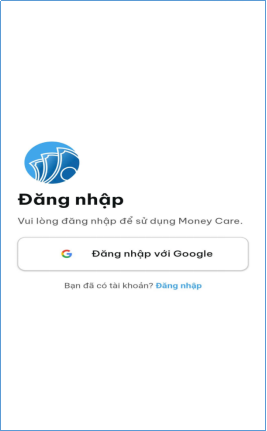
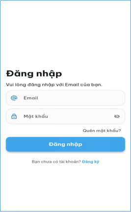
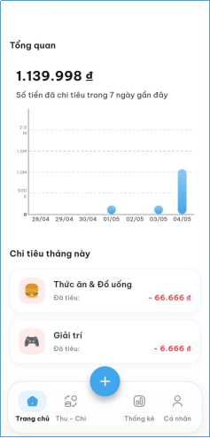
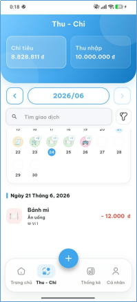
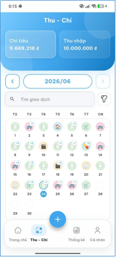
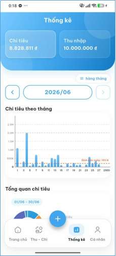
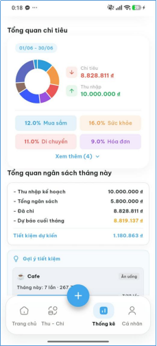
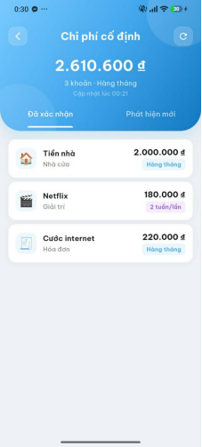
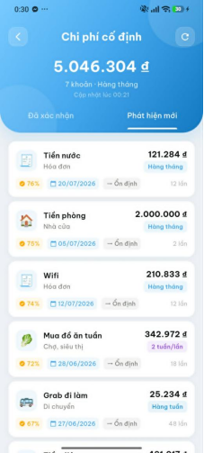
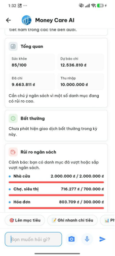

# 💰 Money Care - Ứng Dụng Quản Lý Tài Chính Cá Nhân Thông Minh

<p align="center">
  
</p>

<p align="center">
  <b>Giải pháp quản lý tài chính cá nhân toàn diện, kết hợp Trợ lý AI, nhận diện hóa đơn thông minh và trực quan hóa dòng tiền theo thời gian thực.</b>
</p>

<p align="center">
  
  
  
  
  
  
</p>

---

## 📖 Giới Thiệu Tổng Quan

**Money Care** là ứng dụng di động được xây dựng bằng Flutter nhằm giúp người dùng kiểm soát tài chính cá nhân một cách thông minh, kỷ luật và trực quan. Không chỉ dừng lại ở việc ghi chép thu chi truyền thống, Money Care ứng dụng **Trí tuệ nhân tạo (AI)** để:
- Chấm điểm sức khỏe tài chính và cảnh báo rủi ro bội chi.
- Tự động phát hiện các khoản chi phí cố định / định kỳ từ thói quen chi tiêu.
- Nhập liệu siêu tốc qua quét hóa đơn tự động (OCR Camera) và nhận diện giọng nói (Speech-to-Text).
- Phân tích và dự báo tiến độ hoàn thành các mục tiêu tiết kiệm.

Ứng dụng tuân thủ nghiêm ngặt mô hình **Clean Architecture (Feature-First)**, mang lại khả năng mở rộng, bảo trì và kiểm thử vượt trội.

---

## 🌟 Tính Năng Nổi Bật & Giao Diện Ứng Dụng

### 1. Xác Thực & Bảo Mật Linh Hoạt
Hỗ trợ đăng nhập nhanh chóng bằng Google Sign-In hoặc Email/Mật khẩu với tính năng khôi phục tài khoản và bảo mật nhiều lớp.

| Màn hình đăng nhập một chạm | Đăng nhập bằng Email & Mật khẩu |
| :---: | :---: |
|  |  |
| **Xác thực Google OAuth**: Đăng nhập nhanh chóng, đồng bộ dữ liệu người dùng tức thì. | **Đăng nhập Email chuyên nghiệp**: Xác thực thông tin, quản lý trạng thái hiển thị mật khẩu và quên mật khẩu. |

---

### 2. Trang Chủ & Tổng Quan Dòng Tiền (Dashboard)
Theo dõi dòng tiền hàng tháng, số dư hiện có cùng chuỗi ngày streak giúp rèn luyện thói quen ghi chép tài chính mỗi ngày.

| Dashboard Trang chủ | Bảng chi tiết xu hướng 7 ngày |
| :---: | :---: |
|  |  |
| **Tổng quan thời gian thực**: Thẻ chi tiêu tháng, số dư ví, điểm streak duy trì và danh sách thu/chi gần nhất. | **Phân tích nhanh 7 ngày**: Biểu đồ chi tiêu theo tuần và danh sách nhóm chi tiêu lớn nhất trong tháng. |

---

### 3. Sổ Giao Dịch Thu - Chi Dạng Lịch (Interactive Calendar)
Giao diện xem lịch thu chi trực quan theo từng ngày với các huy hiệu danh mục sinh động, hỗ trợ tìm kiếm và lọc giao dịch tốc độ cao.

| Chi tiết giao dịch theo ngày | Lưới Lịch Thu - Chi toàn tháng |
| :---: | :---: |
|  |  |
| **Tổng quan ngày cụ thể**: Chọn ngày bất kỳ để xem danh sách giao dịch, ví chi trả và số tiền tương ứng. | **Lưới lịch phân loại**: Gắn huy hiệu danh mục (Ăn uống, Giải trí, Hóa đơn...) cho từng ngày trong tháng. |

---

### 4. Báo Cáo Thống Kê & Quản Lý Ngân Sách Chuyên Sâu
Tối ưu hóa ngân sách với biểu đồ chi tiêu hàng ngày có định mức cảnh báo (Daily Spending Limit), biểu đồ Donut phân bổ danh mục và dự báo chi phí cuối tháng.

| Chi tiêu theo ngày & Định mức chi tiêu | Cơ cấu danh mục & Dự báo cuối tháng |
| :---: | :---: |
|  |  |
| **Biểu đồ cột có ngưỡng cảnh báo**: Đặt định mức chi tiêu ngày để phát hiện những ngày chi tiêu đột biến. | **Cơ cấu chi tiêu & AI Gợi ý**: Biểu đồ Donut phân bổ %, bảng dự báo cuối tháng và gợi ý tiết kiệm thông minh. |

---

### 5. Quản Lý Chi Phí Cố Định & AI Phát Hiện Chi Phí Định Kỳ
Hệ thống AI tự động rà soát lịch sử giao dịch để nhận diện các khoản thanh toán định kỳ lặp lại (tiền nhà, tiền điện nước, internet, dịch vụ giải trí) và đưa ra cảnh báo.

| Danh mục chi phí cố định đã xác nhận | AI tự động phát hiện chi phí định kỳ |
| :---: | :---: |
|  |  |
| **Quản lý khoản định kỳ**: Theo dõi các khoản chi cố định hàng tháng, hai tuần một lần (tiền nhà, Netflix, wifi...). | **Thuật toán nhận diện thông minh**: AI gợi ý khoản chi định kỳ mới với tỷ lệ tin cậy (%), tần suất và chu kỳ dự kiến. |

---

### 6. Trợ Lý Tài Chính Thông Minh (Money Care AI Assistant)
Trợ lý AI tích hợp trò chuyện tương tác tự nhiên, đánh giá sức khỏe tài chính, cảnh báo vượt hạn mức ngân sách và mô phỏng rút ngắn mục tiêu tiết kiệm.

| Đánh giá Sức khỏe & Cảnh báo rủi ro | Phân tích & Mô phỏng Mục tiêu tiết kiệm |
| :---: | :---: |
|  |  |
| **Sức khỏe & Rủi ro**: Điểm số tài chính (85/100), cảnh báo danh mục vượt ngưỡng và phát hiện giao dịch bất thường. | **Kế hoạch mục tiêu**: Theo dõi tiến độ tích lũy, gợi ý rút ngắn số ngày hoàn thành mục tiêu dựa trên tiết kiệm thực tế. |

> [!TIP]
> **Nhập liệu đa phương thức**: Money Care AI hỗ trợ nhập liệu qua tin nhắn văn bản, quét hóa đơn tự động qua camera (OCR) và nhận diện giọng nói (Speech-to-Text).

---

## 🏗️ Kiến Trúc Ứng Dụng (Clean Architecture)

Dự án được tổ chức theo mô hình **Clean Architecture** kết hợp phương pháp tổ chức **Feature-First**. Mỗi tính năng nằm độc lập trong thư mục riêng biệt tại `lib/features/`:

```
lib/features/[feature_name]/
├── data/
│   ├── datasources/      # Remote API & Local Data Sources
│   ├── models/           # DTOs, JSON serialization (Freezed, JsonSerializable)
│   └── repositories/     # Cài đặt cụ thể của Repository
├── domain/
│   ├── entities/         # Các thực thể nghiệp vụ cốt lõi (Business Entities)
│   ├── repositories/     # Interfaces trừu tượng của Repository
│   └── usecases/         # Các trường hợp sử dụng nghiệp vụ (Use Cases)
└── presentation/
    ├── controllers/      # GetxController quản lý logic và trạng thái giao diện
    ├── pages/ hoặc views/# Màn hình người dùng (GetView / StatelessWidget)
    └── widgets/          # Các widget tái sử dụng thuộc tính năng
```

### Các Phân Hệ Chính (Core Features)
- `auth`: Đăng ký, đăng nhập email/mật khẩu, Google OAuth, phục hồi mật khẩu.
- `home`: Dashboard tổng quan, thẻ thông tin số dư, dòng tiền chi tiêu.
- `transaction`: Quản lý giao dịch thu/chi, lịch tương tác, bộ lọc danh mục.
- `statistics`: Báo cáo biểu đồ cột, biểu đồ tròn, định mức ngày, dự báo tài chính.
- `spending_plan`: Kế hoạch chi tiêu, quản lý ngân sách danh mục, chi phí cố định.
- `saving_goal`: Quản lý mục tiêu tích lũy, phân kỳ giai đoạn, lịch sử góp quỹ.
- `chatbot`: Trợ lý Money Care AI, hỏi đáp tài chính, xử lý gợi ý.
- `wallet`: Quản lý danh sách ví cá nhân, chuyển tiền giữa các ví.
- `gamification`: Hệ thống streak điểm danh, xếp hạng, khuyến khích kỷ luật tài chính.
- `notification`: Thông báo nhắc nhở ghi chép, cảnh báo vượt ngân sách qua Firebase Cloud Messaging.

---

## 🛠️ Ngăn Xếp Công Nghệ (Tech Stack)

| Lớp công nghệ | Thư viện / Công cụ | Mục đích sử dụng |
| :--- | :--- | :--- |
| **Core Framework** | Flutter SDK (>=3.10.0 <4.0.0), Dart 3 | Nền tảng phát triển ứng dụng đa nền tảng |
| **State Management** | `get: ^4.7.3` | Quản lý trạng thái, Dependency Injection, điều hướng Route |
| **Local Storage** | `get_storage: ^2.1.1`, `shared_preferences: ^2.5.2` | Lưu trữ bộ nhớ đệm, cấu hình người dùng, Dark Mode |
| **Functional Programming**| `fpdart: ^1.1.0` | Xử lý lỗi chức năng (`Either<Failure, Success>`) |
| **Firebase Suite** | `firebase_core`, `firebase_auth`, `cloud_firestore`, `firebase_messaging` | Xác thực người dùng, lưu trữ đám mây, thông báo đẩy FCM |
| **Local Notifications** | `flutter_local_notifications: ^21.0.0` | Bắn thông báo nhắc nhở chi tiêu cục bộ |
| **UI & Charts** | `fl_chart: ^1.1.1`, `percent_indicator: ^4.2.3` | Biểu đồ tài chính động (cột, tròn, xu hướng) |
| **Date & Calendar** | `calendar_date_picker2: ^2.0.1`, `intl: ^0.20.2` | Chọn ngày tháng, định dạng tiền tệ và lịch hiển thị |
| **Icons & Font** | `iconsax_flutter: ^1.0.0`, Font `BeVietnamPro` | Bộ icon thiết kế hiện đại, typography tiếng Việt chuẩn |
| **AI & Nhập liệu** | `google_mlkit_text_recognition: ^0.14.0`, `speech_to_text: ^7.3.0` | Quét hóa đơn OCR tự động và nhập liệu giao dịch bằng giọng nói |
| **Widgets màn hình ngoài** | `home_widget: ^0.9.1` | Tiện ích xem nhanh số dư ngay trên màn hình chính của điện thoại |
| **Code Generation** | `freezed: ^3.2.5`, `json_serializable: ^6.9.0`, `build_runner` | Tự động sinh mã nguồn bất biến và tuần tự hóa JSON |

---

## 📂 Cấu Trúc Thư Mục Dự Án

```
money-care-flutter-v2-main/
├── android/                    # Mã nguồn cấu hình nền tảng Android
├── assets/                     # Tài nguyên nội bộ
│   ├── fonts/                  # Phông chữ BeVietnamPro (Regular, Medium, SemiBold, Bold)
│   ├── icons/                  # Icon danh mục và hệ thống
│   └── images/                 # Logo và hình ảnh tĩnh
├── ios/                        # Mã nguồn cấu hình nền tảng iOS
├── lib/
│   ├── app/                    # Cấu hình cấp ứng dụng
│   │   ├── bindings/           # Khởi tạo DI toàn cục (AppBinding)
│   │   ├── controllers/        # AppController, UserController
│   │   └── router/             # Khai báo GetPage và Route định tuyến
│   ├── core/                   # Các thành phần dùng chung toàn hệ thống
│   │   ├── constants/          # Đường dẫn route, màu sắc, hằng số
│   │   ├── error/              # Định nghĩa Exceptions và Failures
│   │   ├── localization/       # Đa ngôn ngữ (Việt - Anh)
│   │   ├── network/            # ApiClient, HTTP Interceptor
│   │   ├── storage/            # LocalStorage wrapper
│   │   ├── theme/              # Chủ đề giao diện sáng/tối (AppTheme)
│   │   └── utils/              # Định dạng tiền tệ, ngày giờ, validation
│   ├── features/               # 13 phân hệ tính năng theo Clean Architecture
│   ├── firebase_options.dart   # Cấu hình Firebase nền tảng tự động
│   └── main.dart               # Điểm khởi chạy ứng dụng (Entrypoint)
├── screenshots/                # 12 ảnh chụp màn hình minh họa giao diện
├── .env                        # Biến môi trường kết nối API
├── pubspec.yaml                # Khai báo dependencies và assets
└── README.md                   # Tài liệu hướng dẫn dự án
```

---

## 🚀 Hướng Dẫn Cài Đặt & Khởi Chạy

### 1. Yêu cầu môi trường (Prerequisites)
- [Flutter SDK](https://flutter.dev/docs/get-started/install) phiên bản `3.10.0` trở lên.
- [Dart SDK](https://dart.dev/get-dart) phiên bản `3.0.0` trở lên.
- Thiết bị thử nghiệm (Android/iOS vật lý hoặc máy ảo Simulator/Emulator).
- Đã cài đặt Android Studio hoặc VS Code với Flutter Extension.

### 2. Thiết lập Biến Môi Trường (.env)
Tạo file `.env` tại thư mục gốc của dự án `money-care-flutter-v2-main/` với cấu hình kết nối API:

```env
# Địa chỉ Backend NestJS API
API_BASE_URL=https://api.your-moneycare-domain.com
API_LOCALHOST_URL=http://localhost:3000
```

### 3. Cài Đặt Dependencies
Mở terminal tại thư mục dự án và tải các gói phụ thuộc:

```bash
flutter pub get
```

### 4. Sinh Mã Nguồn Tự Động (Code Generation)
Nếu có cập nhật các lớp Model sử dụng `@freezed` hoặc `@JsonSerializable`:

```bash
dart run build_runner build --delete-conflicting-outputs
```

### 5. Cấu Hình Firebase (Tùy chọn nếu cập nhật mới)
Nếu bạn cần kết nối tới dự án Firebase riêng của bạn:

```bash
flutterfire configure
```

### 6. Khởi Chạy Ứng Dụng
Chạy ứng dụng trên thiết bị đang kết nối:

```bash
# Chạy chế độ Debug
flutter run

# Chạy trên thiết bị cụ thể
flutter run -d <device-id>
```

---

## 🤝 Đóng Góp & Phát Triển

1. Fork dự án về tài khoản cá nhân.
2. Tạo nhánh tính năng mới (`git checkout -b feature/tinh-nang-moi`).
3. Commit các thay đổi (`git commit -m 'feat: thêm tính năng mới'`).
4. Đẩy lên nhánh của bạn (`git push origin feature/tinh-nang-moi`).
5. Tạo **Pull Request** để được rà soát và hợp nhất.

---

## 📄 Bản Quyền (License)

Dự án được phát triển cho mục đích quản lý tài chính cá nhân thông minh - **Money Care Team**. Mọi quyền được bảo lưu.
